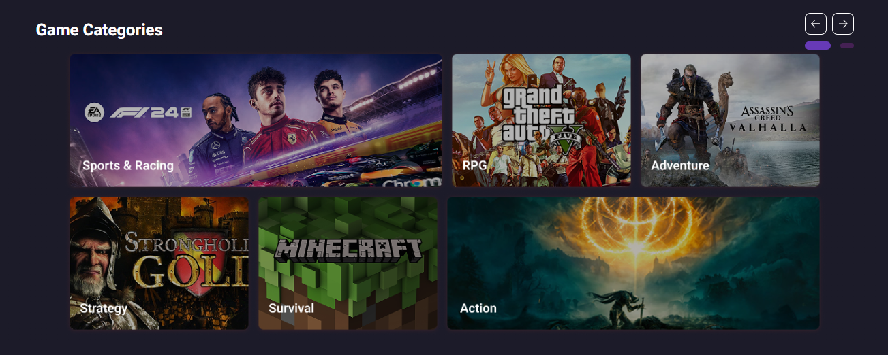
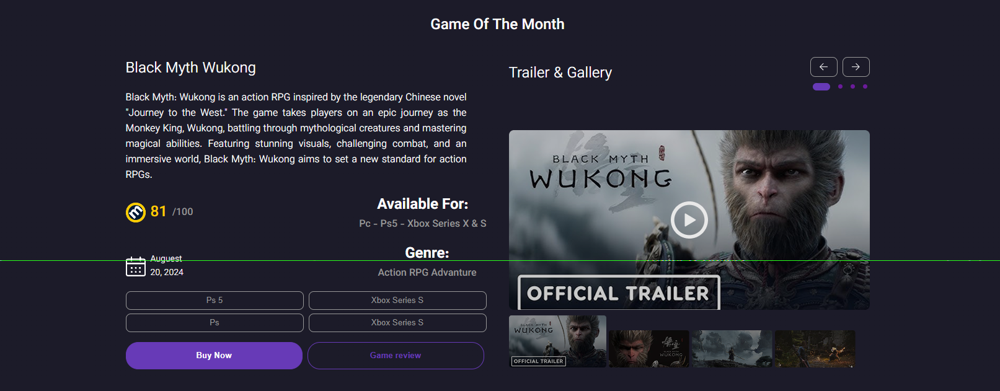
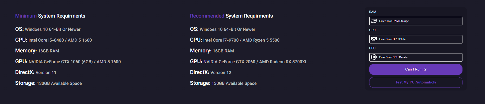
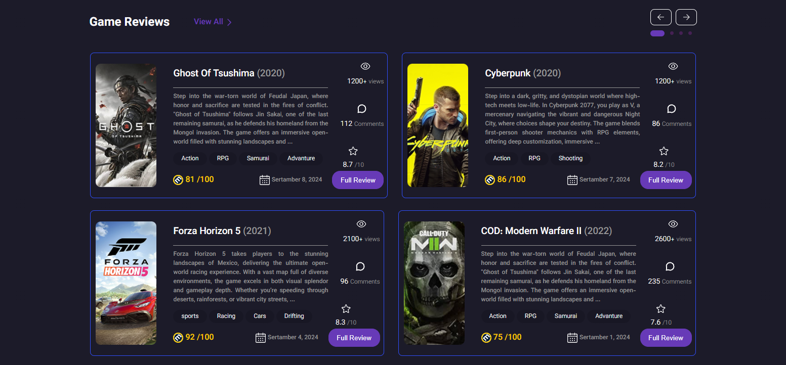
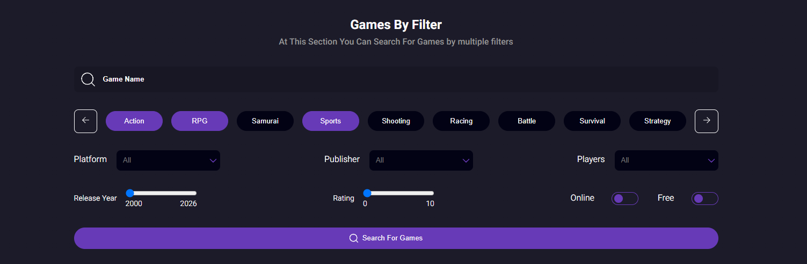
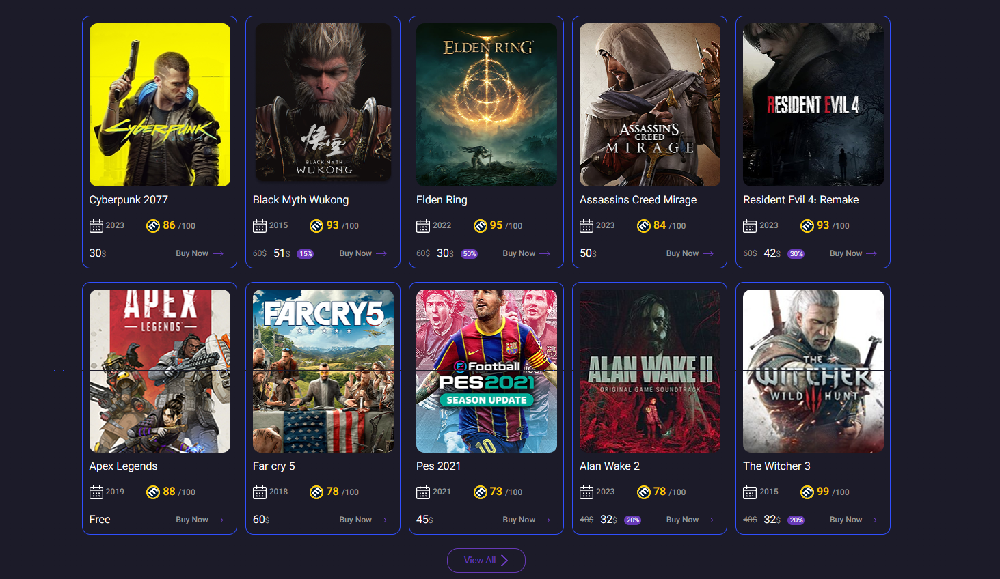

# Gaming Website
####Source code for the `HTML` and `CSS` gaming site, which will also include `JavaScript` and `React` in the future.
---
##Image Website

---

---

---

---

---

---

---

---

---

---

---

---

---
Language:

---
##Other Link:

- [Github Link](https://github.com/Ahoura-CodeR/Website-Game.git)