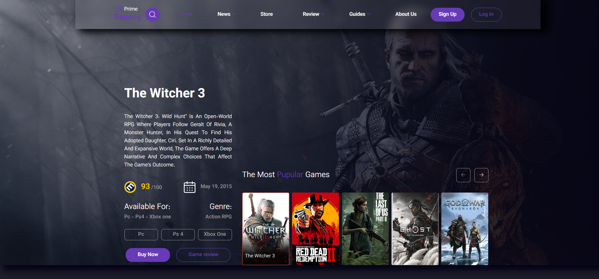
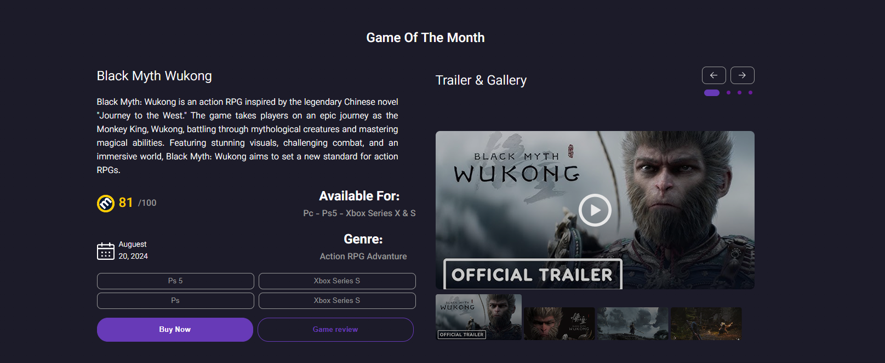
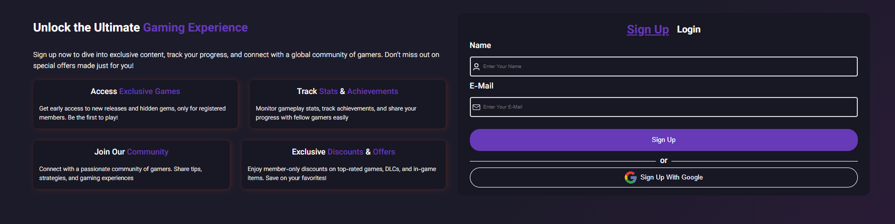
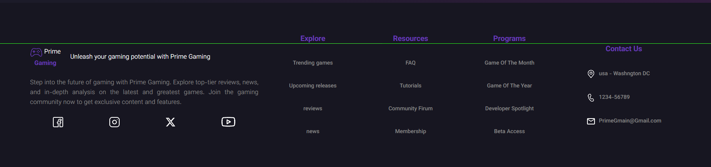

# Gaming Website

Source code for the `HTML` and `CSS` gaming site, which will also include `JavaScript` and `React` in the future.
---
Witcher Universe is a personal web development project created and maintained by Ahoura.
Inspired by the world of The Witcher, this website was built to combine modern web design with an immersive gaming experience. The project began with HTML and CSS and is intended to evolve beyond a static website into a dynamic and interactive platform.
Future updates will introduce JavaScript, React, and potentially backend technologies to add advanced functionality, enhance user interaction, and transform the project into a fully featured web application.
This project reflects both a passion for gaming and a continuous journey of learning, building, and improving modern web development skills.
- [Gaming Portal Website](https://ahoura-coder.github.io/Website-Gaming/)

---
Language:

---

Future

Other Link:

- [website addres](https://ahoura-coder.github.io/Website-Gaming/)
- [Github Link](https://github.com/Ahoura-CodeR/Website-Game.git)